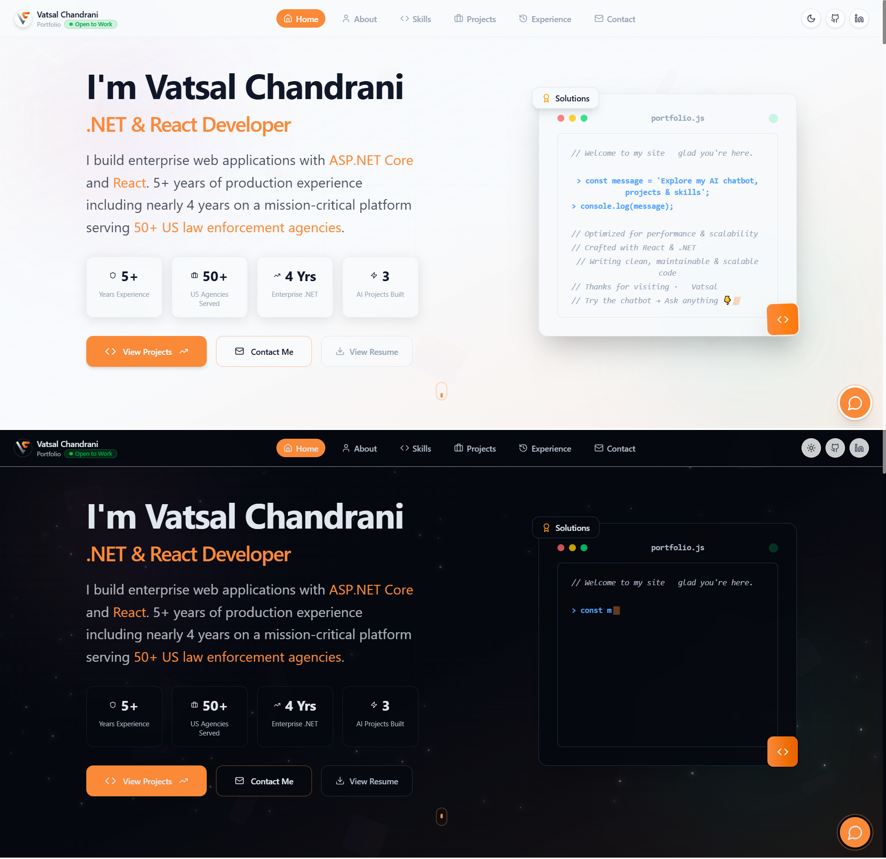

<div align="center">



# Vatsal Chandrani — Developer Portfolio

**Senior .NET & React Developer · Open to Remote Worldwide**

[](https://react.dev)
[](https://vitejs.dev)
[](https://tailwindcss.com)
[](https://vatsalchandrani.me)
[](LICENSE)

🌐 **[Live Demo → vatsalchandrani.me](https://vatsalchandrani.me)**

</div>

---

## ✨ Features

- **AI-Powered Chatbot** — Ask anything about my experience, skills, or projects via an embedded AI assistant (Groq · Llama 3.1 8B)
- **Dark / Light Mode** — Seamless theme switching with system preference detection
- **Animated UI** — Smooth page transitions and micro-interactions powered by Framer Motion
- **Fully Responsive** — Works great on mobile, tablet, and desktop
- **Serverless Backend** — Chat API runs as a Vercel serverless function with rule-based fallback
- **SEO Optimised** — Meta tags, Open Graph, Twitter cards, and JSON-LD structured data

---

## 🛠️ Tech Stack

| Layer | Technology |
|---|---|
| Framework | React 18 + Vite 5 |
| Styling | Tailwind CSS 4 |
| Animations | Framer Motion |
| Routing | React Router DOM 7 |
| UI Primitives | Radix UI |
| Icons | Lucide React · React Icons |
| Theme | next-themes |
| AI | Groq API (Llama 3.1 8B Instant) |
| Serverless | Vercel Functions (Node.js) |
| Analytics | Vercel Analytics |
| Deployment | Vercel |

---

## 🚀 Getting Started

### Prerequisites

- Node.js **v18+**
- npm **v9+**
- A free [Groq API key](https://console.groq.com) *(optional — chatbot falls back to rule-based replies without it)*

### 1. Clone the repo

```bash
git clone https://github.com/vatsal-99/portfolio.git
cd portfolio
```

### 2. Install dependencies

```bash
npm install
```

### 3. Set up environment variables

```bash
cp .env.example .env
```

Open `.env` and add your Groq key:

```env
GROQ_API_KEY=your_groq_api_key_here
```

### 4. Run locally

```bash
# Vite only (no /api/chat — chatbot uses rule-based fallback)
npm run dev

# Full stack with serverless functions (requires Vercel CLI)
npx vercel dev
```

Open [http://localhost:5173](http://localhost:5173)

---

## 🤖 AI Chatbot

The portfolio includes an AI assistant that answers questions about my experience, skills, and projects.

| | |
|---|---|
| **Endpoint** | `POST /api/chat` |
| **Request** | `{ "message": "..." }` |
| **Response** | `{ "reply": "..." }` |
| **Model** | Llama 3.1 8B Instant via Groq |
| **Fallback** | Rule-based responses if Groq is unavailable |

> The API key is never exposed to the browser. It lives in Vercel's environment variables on the server side.

---

## 📁 Project Structure

```
├── api/
│   └── chat.js              # Vercel serverless function (AI chatbot)
├── public/                  # Static assets & resume PDFs
├── src/
│   ├── components/
│   │   ├── HeroSection.jsx
│   │   ├── AboutSection.jsx
│   │   ├── SkillsSection.jsx
│   │   ├── ProjectsSection.jsx
│   │   ├── ExperienceSection.jsx
│   │   ├── ContactSection.jsx
│   │   ├── PortfolioChatbot.jsx
│   │   ├── Navbar.jsx
│   │   └── Footer.jsx
│   ├── pages/
│   │   ├── Home.jsx
│   │   └── NotFound.jsx
│   └── lib/
│       ├── chatApi.js
│       └── portfolioChatbot.js
├── .env.example             # Environment variable template
├── vercel.json              # Vercel routing config
└── vite.config.js
```

---

## ☁️ Deploy to Vercel

1. Push this repo to GitHub
2. Go to [vercel.com](https://vercel.com) → **Add New Project** → import your repo
3. Add the environment variable:

   | Name | Value |
   |---|---|
   | `GROQ_API_KEY` | your Groq API key |

4. Click **Deploy** — done!

`vercel.json` handles SPA routing automatically so React Router works correctly in production.

---

## 🙌 Using This as a Template

Feel free to fork this repo and use it for your own portfolio:

1. Fork → clone → `npm install`
2. Edit the content in each section component under `src/components/`
3. Replace resume PDFs in `public/`
4. Update meta tags in `index.html`
5. Add your own `GROQ_API_KEY` and update the chatbot context in `src/lib/portfolioChatbot.js`
6. Deploy to Vercel

If you find it useful, a ⭐ on the repo is appreciated!

---

## 📬 Contact

**Vatsal Chandrani**
- 🌐 [vatsalchandrani.me](https://vatsalchandrani.me)
- 💼 [LinkedIn](https://linkedin.com/in/vatsal-chandrani)
- 🐙 [GitHub](https://github.com/vatsal-99)
- 📧 vatsal1214@gmail.com

---

<div align="center">
Made with React · Deployed on Vercel
</div>
